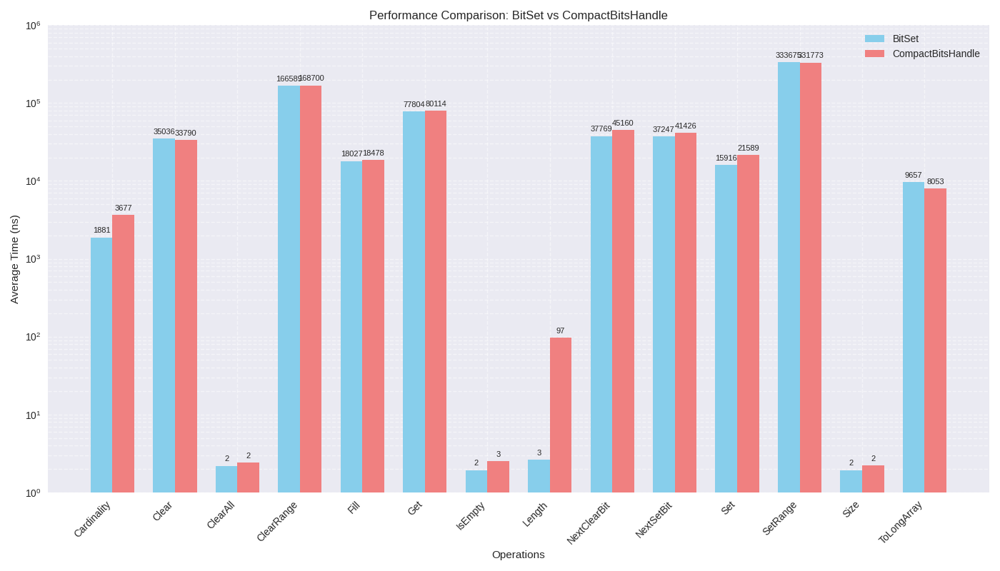

# 功能
为需要处理 BitSet 功能，提供节约内存的方案。

# 测试结果
Benchmark                                                 Mode  Cnt       Score       Error  Units
CompactBitsHandleBenchmark.benchmarkBitSet_Cardinality    avgt    5    1880.812 ±    30.263  ns/op
CompactBitsHandleBenchmark.benchmarkBitSet_Clear          avgt    5   35036.464 ±  8431.616  ns/op
CompactBitsHandleBenchmark.benchmarkBitSet_ClearAll       avgt    5       2.190 ±     0.027  ns/op
CompactBitsHandleBenchmark.benchmarkBitSet_ClearRange     avgt    5  166588.627 ±  4364.830  ns/op
CompactBitsHandleBenchmark.benchmarkBitSet_Fill           avgt    5   18027.146 ±   270.414  ns/op
CompactBitsHandleBenchmark.benchmarkBitSet_Get            avgt    5   77803.666 ±  1692.553  ns/op
CompactBitsHandleBenchmark.benchmarkBitSet_IsEmpty        avgt    5       1.933 ±     0.128  ns/op
CompactBitsHandleBenchmark.benchmarkBitSet_Length         avgt    5       2.623 ±     0.038  ns/op
CompactBitsHandleBenchmark.benchmarkBitSet_NextClearBit   avgt    5   37769.176 ±  1053.470  ns/op
CompactBitsHandleBenchmark.benchmarkBitSet_NextSetBit     avgt    5   37246.574 ±  3005.507  ns/op
CompactBitsHandleBenchmark.benchmarkBitSet_Set            avgt    5   15915.899 ±   322.368  ns/op
CompactBitsHandleBenchmark.benchmarkBitSet_SetRange       avgt    5  333674.511 ±  6948.195  ns/op
CompactBitsHandleBenchmark.benchmarkBitSet_Size           avgt    5       1.931 ±     0.091  ns/op
CompactBitsHandleBenchmark.benchmarkBitSet_ToLongArray    avgt    5    9657.342 ±   301.986  ns/op
CompactBitsHandleBenchmark.benchmarkCompact_Cardinality   avgt    5    3676.884 ±    85.948  ns/op
CompactBitsHandleBenchmark.benchmarkCompact_Clear         avgt    5   33789.927 ±  3449.218  ns/op
CompactBitsHandleBenchmark.benchmarkCompact_ClearAll      avgt    5       2.393 ±     0.018  ns/op
CompactBitsHandleBenchmark.benchmarkCompact_ClearRange    avgt    5  168700.367 ±  3599.398  ns/op
CompactBitsHandleBenchmark.benchmarkCompact_Fill          avgt    5   18477.606 ±   886.528  ns/op
CompactBitsHandleBenchmark.benchmarkCompact_Get           avgt    5   80113.866 ±  2097.198  ns/op
CompactBitsHandleBenchmark.benchmarkCompact_IsEmpty       avgt    5       2.531 ±     0.098  ns/op
CompactBitsHandleBenchmark.benchmarkCompact_Length        avgt    5      97.292 ±     0.642  ns/op
CompactBitsHandleBenchmark.benchmarkCompact_NextClearBit  avgt    5   45159.984 ±  3579.007  ns/op
CompactBitsHandleBenchmark.benchmarkCompact_NextSetBit    avgt    5   41425.985 ±  2931.473  ns/op
CompactBitsHandleBenchmark.benchmarkCompact_Set           avgt    5   21589.121 ±   241.408  ns/op
CompactBitsHandleBenchmark.benchmarkCompact_SetRange      avgt    5  331772.937 ± 23184.304  ns/op
CompactBitsHandleBenchmark.benchmarkCompact_Size          avgt    5       2.197 ±     0.048  ns/op
CompactBitsHandleBenchmark.benchmarkCompact_ToLongArray   avgt    5    8052.653 ±   493.752  ns/op

